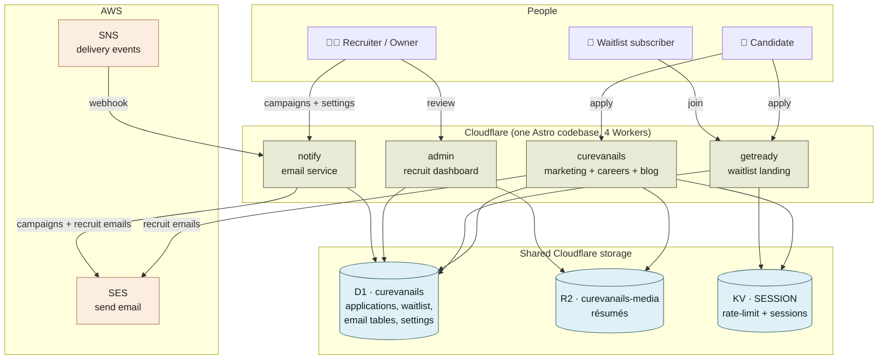
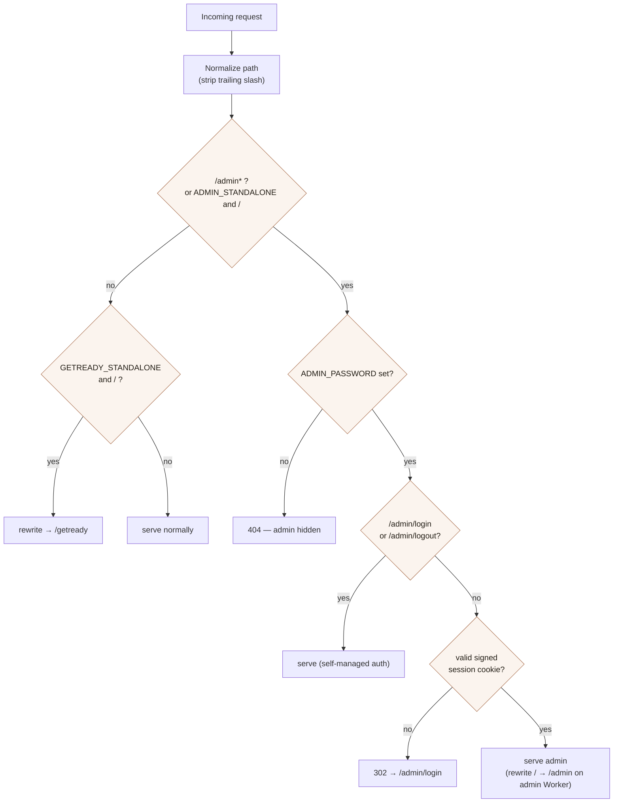
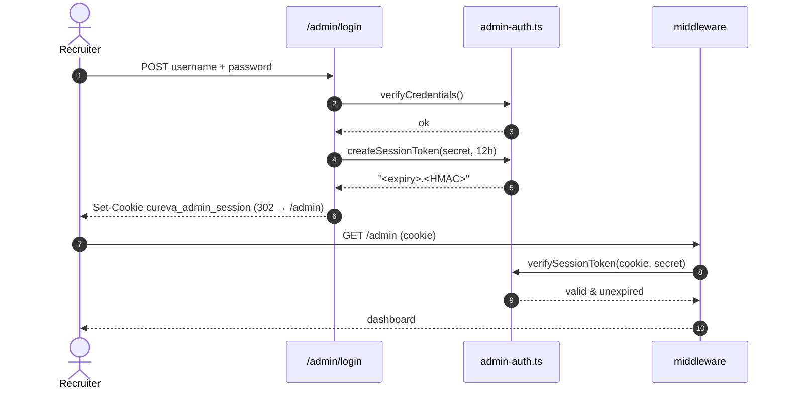
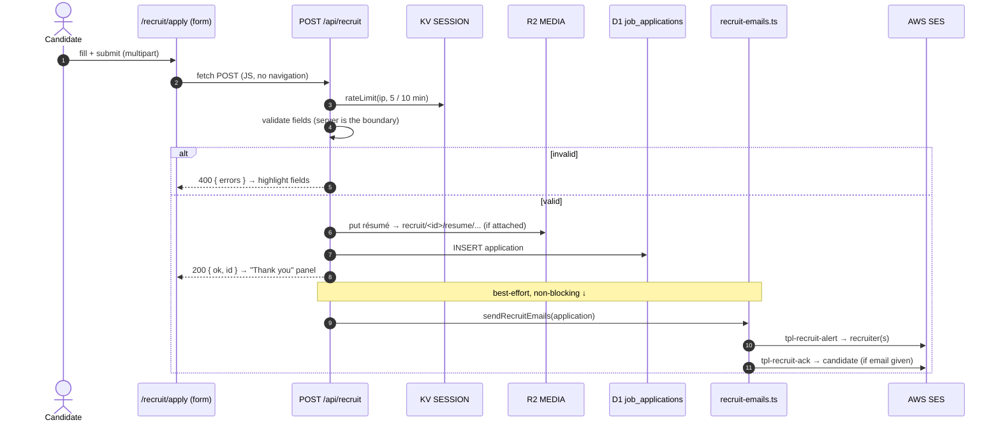
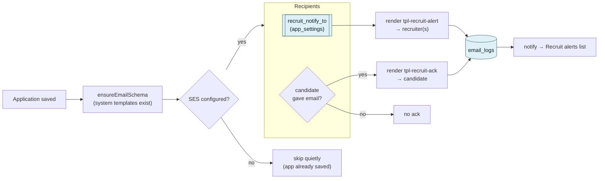
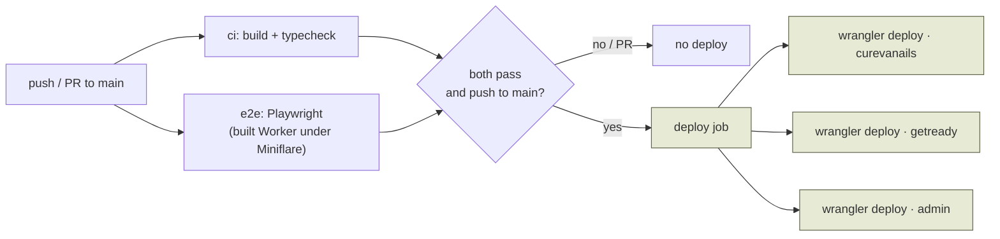
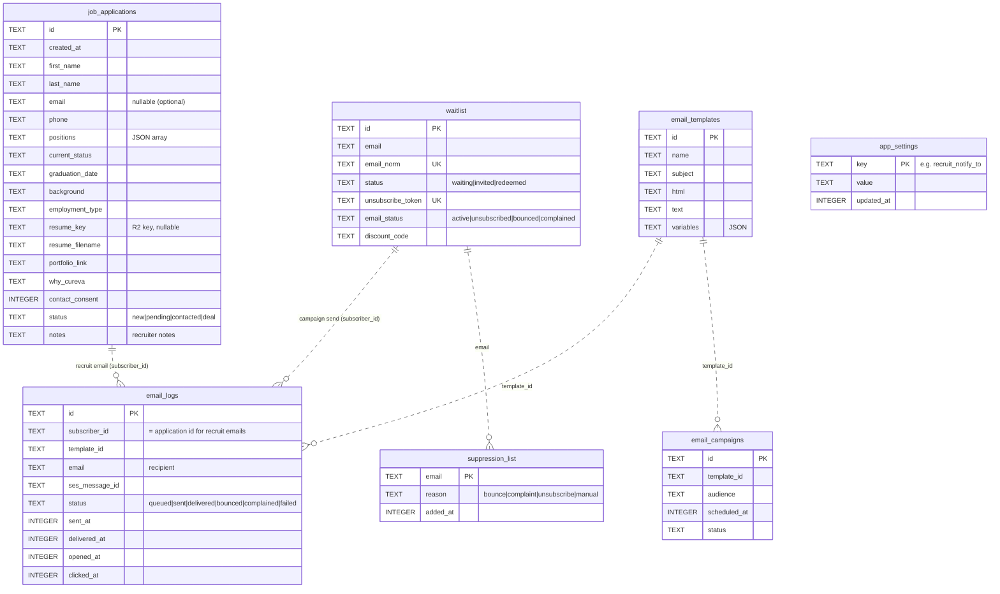

# CureVà — System Architecture

A single, diagram-first map of how the CureVà platform fits together, for both
humans and AI agents. Read this first; the deep-dive docs are linked at the end.

> **TL;DR** — One Astro codebase deploys as **four Cloudflare Workers** that all
> share **one D1 database, one R2 bucket, and one KV namespace**. A public
> marketing/careers site, a waitlist landing page, a recruiter admin dashboard,
> and a standalone email service are all the *same code* wearing different hats,
> selected by an environment flag. Email goes out through **AWS SES**; delivery
> events come back through **AWS SNS**.

---

## 1. The big picture



**Why one codebase, four Workers?** The marketing site, waitlist landing, and
admin dashboard are the same app; a `*_STANDALONE` var (read in
`src/middleware.ts`) changes only what the root path (`/`) serves. `notify` is a
separate repo ([`notifications-service`](https://github.com/curevanails/notifications-service))
but points at the **same D1 database id**, which is what lets the two sides
cooperate without any cross-service API calls.

---

## 2. The four Workers

| Worker | Repo · config | Root `/` serves | `*_STANDALONE` | Extra binding |
| --- | --- | --- | --- | --- |
| **curevanails** | this repo · `wrangler.jsonc` | marketing landing + blog | — | KV `SESSION` |
| **getready** | this repo · `wrangler.getready.jsonc` | `/getready` waitlist landing | `GETREADY_STANDALONE` | — |
| **admin** | this repo · `wrangler.admin.jsonc` | rewrites `/` → `/admin` | `ADMIN_STANDALONE` | — |
| **notify** | `notifications-service` · `wrangler.jsonc` | email dashboard | — | KV `SESSION`, Cron `*/5` |

All four share **D1 `curevanails`** (`fcc8f06b-…`) and **R2 `curevanails-media`**.
Custom domains (`admin.curevanails.com`, `getready.curevanails.com`,
`notify.curevanails.com`) are wired in the Cloudflare dashboard, **not** in the
wrangler configs — a fresh deploy won't recreate them.

Deploy is E2E-gated in CI; the main site's deploy job ships **all three** of
this repo's Workers ([§7](#7-cicd--deploy)).

---

## 3. Request routing & middleware

Every request passes through `src/middleware.ts`, which does two jobs: pick what
`/` means for the current Worker, and gate the admin area.



Key rule: **if `ADMIN_PASSWORD` is unset, the whole `/admin` area returns 404** —
that's why `/admin` stays invisible on the public marketing Worker even though
the route physically exists in the shared code.

---

## 4. Authentication (admin & notify)

Auth is a **stateless, signed session cookie** — no server-side session store.
The token is `"<expiry>.<HMAC-SHA256(secret, expiry)>"`; verifying it needs only
the secret, and rotating the secret invalidates every outstanding cookie.



- **Signing secret:** a dedicated `SESSION_SECRET` when set, otherwise it falls
  back to `ADMIN_PASSWORD` (with a warning). Using a separate secret means a
  captured cookie can't be used to brute-force the login password offline.
- Cookie: `cureva_admin_session`, HttpOnly, 12-hour TTL.
- The identical mechanism protects the `notify` dashboard (its own repo).

---

## 5. Recruit application flow

The end-to-end path when a candidate applies at `/recruit/apply`.



**Design guarantees**
- **The applicant's result never depends on email.** The application is saved
  first; `sendRecruitEmails` is wrapped and swallows every error, so a failed or
  unconfigured send still returns `ok`.
- **The server is the validation boundary.** The client validator is a
  convenience; `/api/recruit` re-checks everything.
- **Résumé is optional** and, when present, goes to R2 under
  `recruit/<application-id>/resume/<uuid>-<sanitised-name>`.

Full field contract → [`RECRUIT.md`](RECRUIT.md).

---

## 6. Recruit emails (recruiter alert + candidate acknowledgement)

Both recruit emails are **DB "system templates"** (Handlebars), sent through the
shared `sendOne` path so each is logged to `email_logs` and shows up on the
notify dashboard — no separate mailer.



| Template id | Goes to | Purpose |
| --- | --- | --- |
| `tpl-recruit-alert` | recruiter address(es) in `recruit_notify_to` | "New application from <name>" + details + admin link |
| `tpl-recruit-ack` | the candidate (only if they gave an email) | "We've received your application — we'll reach out soon" |

- **`recruit_notify_to`** lives in the shared `app_settings` table and is edited
  on the notify dashboard (**notify → Settings**). The main site *reads* it.
- **System templates** are ensured by id (`INSERT OR IGNORE`) on every schema
  check, so they always exist to render, yet operator edits are preserved.
- ⚠️ **SES sandbox** only delivers to *verified* addresses. Candidate acks to
  arbitrary applicants require SES **production access**.

---

## 7. CI/CD & deploy

Push to `main` → tests must pass → deploy. Deploy is **gated** on E2E.



- Workflow: `.github/workflows/deploy.yml`. PRs run the tests but never deploy.
- The deploy job ships **all three** Workers via the `pnpm deploy*` scripts
  (each sets `WRANGLER_CONFIG` so the astro build + `wrangler deploy` target the
  right Worker).
- Secrets needed in CI: `CLOUDFLARE_API_TOKEN`, `CLOUDFLARE_ACCOUNT_ID`.
- Details & conventions → [`TESTING.md`](TESTING.md).

---

## 8. Data model (D1)

One database, shared by all Workers. Timestamps are ISO strings in the
recruit/waitlist tables and **Unix-ms integers** in the email tables (kept
internally consistent per domain).



All tables are **lazily created** by `ensure…Schema` helpers on first use — there
is no migration step. See `src/utils/recruit-db.ts`, `waitlist-db.ts`,
`email-db.ts`, `app-settings.ts`.

---

## 9. Where things live (repo map)

```
src/
├─ middleware.ts               Worker routing (getready/admin) + admin auth gate
├─ pages/
│  ├─ index.astro              CureVà marketing landing (standalone design system)
│  ├─ recruit.astro            Careers page → links to /recruit/apply
│  ├─ recruit/apply.astro      The Hiring Form (client validation + fetch submit)
│  ├─ api/recruit.ts           Intake: validate → R2 → D1 → recruit emails
│  ├─ admin/                   Dashboard, login, logout, file.ts (R2 dl), update.ts
│  └─ getready.astro           Waitlist landing (email capture)
├─ utils/
│  ├─ recruit-db.ts            job_applications schema + option vocabularies
│  ├─ recruit-emails.ts        recruiter alert + candidate ack (system templates)
│  ├─ app-settings.ts          shared key/value store (recruit_notify_to)
│  ├─ email-db.ts              email tables + default/system template seeding
│  ├─ email/ses-client.ts      SES send + suppression precheck
│  ├─ email/send-service.ts    sendOne (render + log + send)
│  └─ admin-auth.ts            signed-cookie session helpers
└─ e2e/                        Playwright suites (recruit-apply, admin)
```

---

## 10. Deep-dive docs

| Doc | What it covers |
| --- | --- |
| [`RECRUIT.md`](RECRUIT.md) | Hiring-Form field contract, validation, D1 columns, R2 layout |
| [`ADMIN.md`](ADMIN.md) | Recruit admin dashboard, auth, `/admin/file`, `/admin/update` |
| [`EMAIL.md`](EMAIL.md) | SES email infra, templates, SNS webhook, suppression |
| [`TESTING.md`](TESTING.md) | Playwright E2E suite + the deploy pipeline |
| [`DESIGN.md`](DESIGN.md) | getready waitlist landing design |
| notify repo `docs/ARCHITECTURE.md` | The email service in depth (campaigns, SNS, unsubscribe) |

> **Rendering the diagrams:** every diagram above is a Mermaid code block, which
> GitHub, VS Code (with the Mermaid extension), and most Markdown viewers render
> natively. No build step required.
